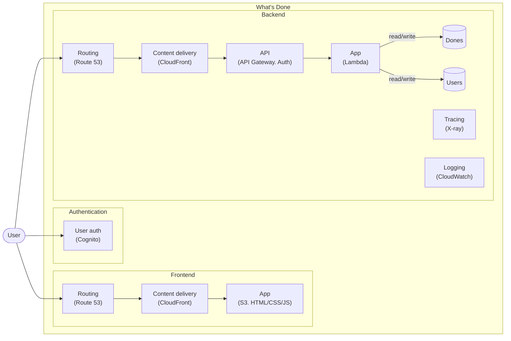

[](https://github.com/ryu1kn/whatsdone/actions/workflows/whatsdone.yml)

# What's Done

Personal activity tracker. Take memos of what I (or we) have done today.

This is my toy project that I experiment different technologies/tools I want to try.

## Architecture



## Technology Stack

- infrastructure
  - ~~heroku + MongoDB~~
  - ~~heroku + DynamoDB~~
  - ~~AWS Elastic Beanstalk (deployed with `kumo`) + DynamoDB~~
  - AWS API Gateway + Lambda + DynamoDB (all deployed with `kumo`) ⬅️ Now here
    - with other components including: CloudFormation, CloudFront, Route53, X-Ray, Cognito, S3
- backend
  - ~~JavaScript~~ (deployed on AWS Lambda)
  - TypeScript (deployed on AWS Lambda) ⬅️ Now here
- frontend
  - ~~JavaScript + React + flux~~
  - ~~JavaScript + React + Redux~~
  - TypeScript + React + Redux ⬅️ Now here

## Continuous Integration / Continuous Delivery

Commits to the `main` branch automatically goes to the production after the successful build/test execution.
This includes the changes to the infrastructure.

For CI/CD, What's Done uses [GitHub Actions](https://github.com/ryu1kn/whatsdone/actions).
For more information about CI setup, see its [README](./ci/README.md).

### Partial build

To reduce the build time, What's Done CI leverages [Build Mate](https://www.npmjs.com/package/buildmate)
to trigger commands that are relevant to files changed.

Currently, What's Done CI checks git commit range of the current build to find changed files.
However, this is sometimes not what you want. To force the build to get the file list of
desired commit range, you can include `[COMMIT_RANGE:sha1...sha2]` in your commit message.

Note that the actual commit used in the build is still `HEAD`. It is just to make the build
to work on different file list.

### Deploying entire system

If you want to deploy `prod` environment, you need to have `prod` config in modules then execute:

```sh
$ AWS_PROFILE=your-profile AWS_REGION=ap-southeast-2 ENV_NAME=prod ./deploy-system.sh
```

## Installing dev dependencies

This project uses [mise](https://github.com/jdx/mise) to install necessary dependencies.

```sh
mise trust
mise install
```

## Test

* Unit test: Backend/frontend modules have their own unit test.
* Performance test: Written in Scala using Gatling. see its [README](./test/performance/README.md).
* End-to-end test: Written in JavaScript. see its [README](./test/e2e/README.md).

## Tools

* Migrate done data from mongodb to dynamodb (written in Go). See its [README](./tools/copy-done-table/README.md).
* What's Done API Client (written in Haskell). See its [README](./tools/api-client/README.md).
